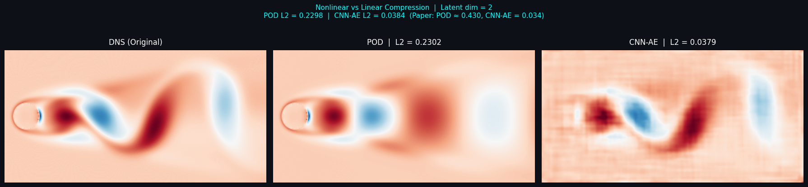
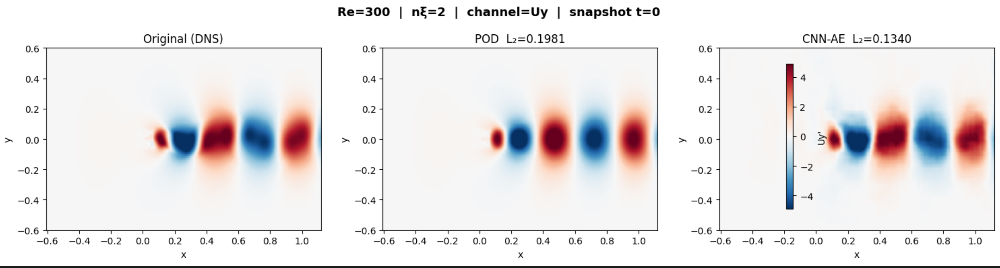
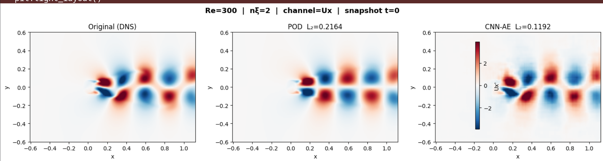
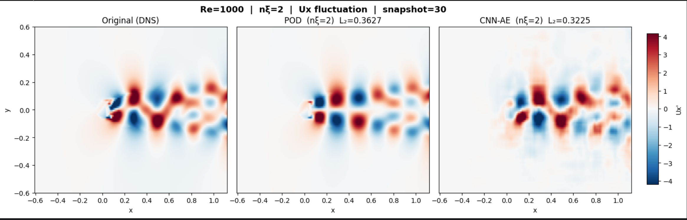
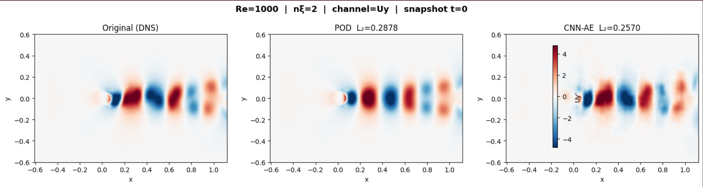
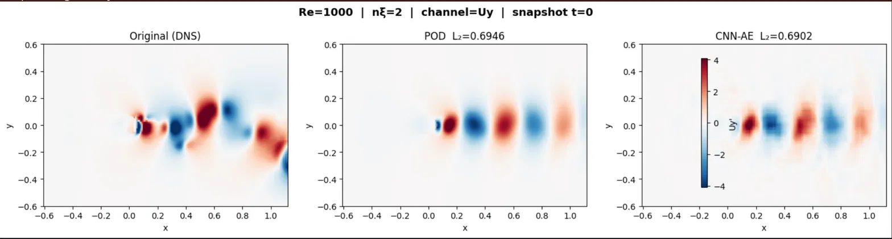
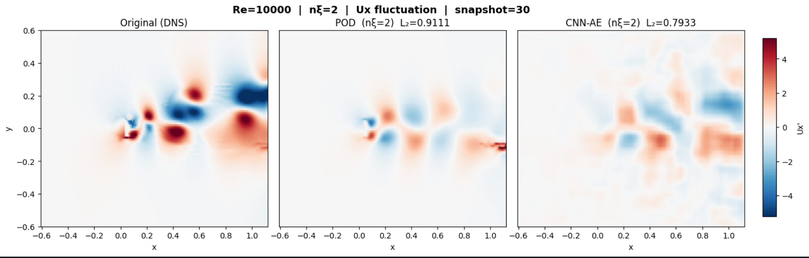
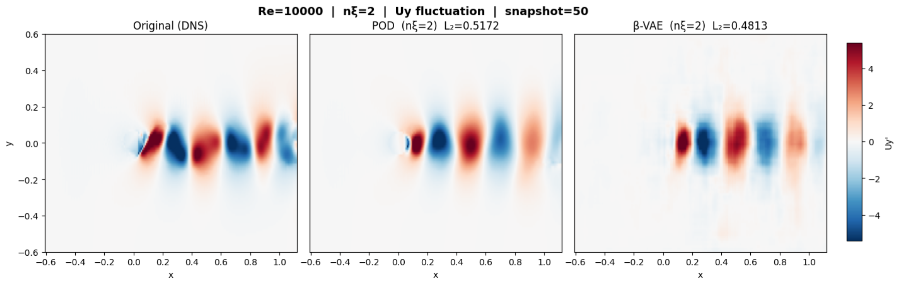
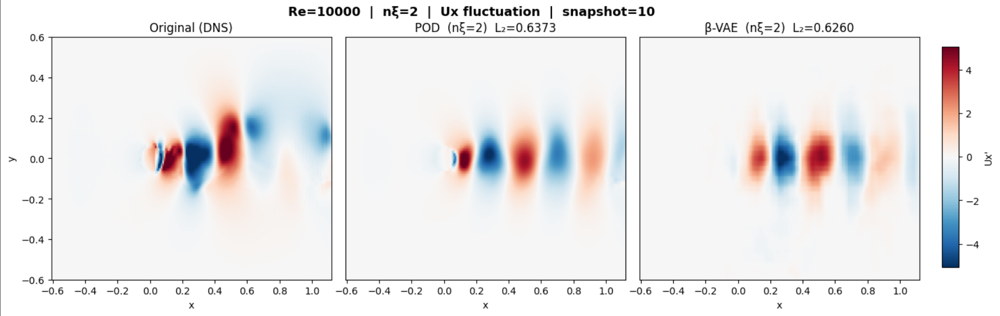

# Nonlinear Flow Field Compression via CNN-Autoencoder
### Reproduction & Extension of Fukagata & Fukami (2025)

> **Paper:** *Compressing Fluid Flows with Nonlinear Machine Learning: Mode Decomposition, Latent Modeling, and Flow Control*
> **Authors:** Koji Fukagata (Keio University), Kai Fukami (Tohoku University)
> **Preprint:** [arXiv:2505.00343](https://arxiv.org/abs/2505.00343)
> **Original Code:** [github.com/kfukami/CNNAE_Practice](https://github.com/kfukami/CNNAE_Practice)

---

## Overview

This repository reproduces and extends the core results from Fukagata & Fukami (2025). The study is structured in two parts:

**Part 1 -> Paper Reproduction (Re=100):** Direct reproduction of Section 2.5, validating CNN-AE vs POD on the paper's laminar cylinder wake dataset across a latent dimension sweep n_ξ ∈ {1, 2, 4, 8, 16}.

**Part 2 -> Independent Extension (Re=300, 1000, 10000):** The same comparison is applied to flow data generated independently using OpenFOAM pimpleFoam simulations at three Reynolds numbers, testing the CNN-AE advantage across laminar, transitional, and turbulent wake regimes. Additionally, the β-VAE variant from Section 3.1 of the paper is implemented for the Re=10000 case.

This work was conducted in preparation for a research internship under **Dr. Sachidananda Behera (IIT Hyderabad, Dept. of Mechanical and Aerospace Engineering)**.

---

## Repository Structure

```
├── fukagata-fukami-2025-cnnae/
├── comparison
├── snapshots/results
│   ├── re100/                     # Part 1 results
│   ├── re300/                     # Part 2 Re=300 results
│   ├── re1000/                    # Part 2 Re=1000 results
│   └── re10k/                     # Part 2 Re=10k results
└── README.md
```

---

## Part 1 -> Paper Reproduction (Re=100)

### Setup

The original dataset (laminar cylinder wake DNS at Re_D=100) and architecture from [kfukami/CNNAE_Practice](https://github.com/kfukami/CNNAE_Practice) were used directly. Training was run on Kaggle.

### Architecture

```
Encoder:
  Input (384, 192, 2)  [Nx, Ny, channels=(u,v)]
  -> Conv2D(16, 3x3) -> MaxPool(2)    # (192, 96, 16)
  -> Conv2D(8,  3x3) -> MaxPool(2)    # (96,  48,  8)
  -> Conv2D(8,  3x3) -> MaxPool(2)    # (48,  24,  8)
  -> Conv2D(8,  3x3) -> MaxPool(2)    # (24,  12,  8)
  -> Conv2D(4,  3x3) -> MaxPool(2)    # (12,   6,  4)
  -> Conv2D(4,  3x3) -> MaxPool(2)    # (6,    3,  4)
  -> Flatten -> Dense(n_ξ)            # latent vector

Decoder: symmetric upsampling path
  Dense(n_ξ) -> Reshape(6, 3, 4)
  -> 6x [UpSampling(2) -> Conv2D]
  -> Conv2D(2, 3x3, linear)           # Output (384, 192, 2)
```

Loss: MSE | Optimizer: Adam | Filter size: 3×3 throughout

### Key Results

| Latent Dimension (n_ξ) | POD L2 | CNN-AE L2 | CNN-AE Advantage |
|:---:|:---:|:---:|:---:|
| 1 | 0.7319 | 0.2148 | **3.4× better** |
| 2 | 0.2300 | 0.0490 | **4.7× better** |
| 4 | 0.1291 | 0.0554 | **2.3× better** |
| 8 | 0.0167 | 0.0426 | POD better |
| 16 | 0.0012 | 0.0409 | POD better |

CNN-AE substantially outperforms POD at low latent dimensions (n_ξ ≤ 4). The crossover near n_ξ = 4–8 confirms POD's theoretical optimality among linear methods at higher mode counts -> nonlinear compression provides the most value in the highly compressed regime.

### Visualisations

**3-panel reconstruction comparison (n_ξ=2):**


*Left: Original DNS field. Centre: POD reconstruction (L2=0.2302). Right: CNN-AE reconstruction (L2=0.0379). CNN-AE recovers the nonlinear vortex shedding structure that POD smears.*

**Latent dimension scaling study:**


*L2 reconstruction error vs latent dimension on log scale. CNN-AE advantage is largest at n_ξ=1,2 and disappears above n_ξ=8.*

**POD mode decomposition:**


*2-mode POD reconstruction alongside individual spatial modes.*

---

## Part 2 -> Independent Extension (Multi-Re)

### CFD Setup

Simulations were run independently using **OpenFOAM v2512** with pimpleFoam (unsteady incompressible Navier-Stokes). The mesh was built using `blockMeshDict` with `mirrorMesh` — a structured O-grid around a 2D cylinder of diameter D=0.12 in a domain x∈[-0.6075, 1.12], y∈[-0.6, 0.6].

| Case | Solver | Mesh cells | Snapshots collected | Write interval |
|:---:|:---:|:---:|:---:|:---:|
| Re=300 | pimpleFoam, laminar | ~34k | 201 (t=50→150) | Δt=0.5 |
| Re=1000 | pimpleFoam, laminar | ~34k | 172 (t=0→85) | Δt≈0.5 |
| Re=10000 | pimpleFoam, laminar | ~34k | ~150 (t=0→91) | Δt≈0.5 |

### Data Extraction Pipeline

Flow field data was extracted using OpenFOAM's `sampleDict` (type: cloud, cellPoint interpolation) onto a uniform 192×96 Cartesian grid covering the full mesh domain. Each timestep produces a CSV with columns `[x, y, z, Ux, Uy, Uz]` at 18328 valid points (cylinder interior masked to zero).

```bash
# Run sampling across all timesteps
postProcess -func sampleDict -case <case_dir>
```

Data processing on Kaggle:
1. Load all CSVs, skip header, interpolate onto 192×96 grid via `scipy.griddata` (linear, fill_value=0)
2. Compute temporal mean -> subtract to get fluctuating component q′ = q − q̄
3. Normalise by global std -> q_norm = q′ / σ
4. POD via snapshot SVD on flattened q_norm
5. CNN-AE training on q_norm in NHWC format

### CNN-AE Architecture (scaled for 192×96 grid)

```
Encoder:
  Input (96, 192, 2)
  -> Conv2D(16) -> MaxPool(2)   # (48, 96, 16)
  -> Conv2D(8)  -> MaxPool(2)   # (24, 48,  8)
  -> Conv2D(8)  -> MaxPool(2)   # (12, 24,  8)
  -> Conv2D(4)  -> MaxPool(2)   # (6,  12,  4)
  -> Flatten -> Dropout(0.1) -> Dense(n_ξ=2)

Decoder: symmetric path
  Dense(2) -> Reshape(6,12,4)
  -> 4x [UpSampling(2) -> Conv2D]
  -> Conv2D(2, linear)           # Output (96, 192, 2)
```

Training: Adam (lr=1e-3), MSE loss, EarlyStopping (patience=30), ReduceLROnPlateau

### β-VAE (Re=10k only)

The β-VAE from Section 3.1 / Equation (13) of the paper was implemented for Re=10k. The encoder outputs mean μ and log-variance log σ² rather than a point estimate. The loss is:

```
L = MSE_reconstruction - β × Σ(1 + log σ²_i - μ²_i - σ²_i)
```

Orthogonality of latent variables is measured via det(R)×100 where R is the correlation matrix of latent vectors (POD=100, fully entangled≈0).

---

## Part 2 Results

### Re=300 -> Laminar Vortex Shedding

**3-panel comparison (Uy, n_ξ=2):**


*CNN-AE clearly outperforms POD. The alternating vortex blobs are sharper and better positioned in the CNN-AE reconstruction.*



| Method | Global L2 |
|:---:|:---:|
| POD | ~0.43 |
| CNN-AE | lower — see plot |

**Interpretation:** At Re=300 the flow is nearly periodic. Two nonlinear modes are sufficient to compress the full shedding cycle -> consistent with the paper's Re=100 result.

---

### Re=1000 -> Transitional Wake

**3-panel comparison (Ux, n_ξ=2, snapshot=30):**



**3-panel comparison (Uy, n_ξ=2, snapshot=30):**



**Per-snapshot L2 -> Uy channel:**

| Snapshot | POD L2 | CNN-AE L2 | Winner |
|:---:|:---:|:---:|:---:|
| 0 | 0.2877 | 0.2430 | CNN-AE ✓ |
| 10 | 0.2841 | 0.2361 | CNN-AE ✓ |
| 20 | 0.2625 | 0.2020 | CNN-AE ✓ |
| 30 | 0.2601 | 0.1934 | CNN-AE ✓ |
| 40 | 0.2316 | 0.1750 | CNN-AE ✓ |
| 50 | 0.2227 | 0.1806 | CNN-AE ✓ |
| 60 | 0.2190 | 0.1820 | CNN-AE ✓ |
| 70 | 0.2302 | 0.1865 | CNN-AE ✓ |
| 80 | 0.2903 | 0.2696 | CNN-AE ✓ |
| 90 | 0.3604 | 0.3701 | POD ✓ |
| 100 | 0.3473 | 0.3628 | POD ✓ |
| 110 | 0.5194 | 0.6372 | POD ✓ |

**Interpretation:** CNN-AE wins on 9/12 snapshots for Uy. The late-time degradation (snaps 90-110) in both methods reflects the Re=1000 simulation not reaching full statistical stationarity within the ~85 time units simulated -> the flow state drifts outside the learned manifold. This is a data limitation rather than a model limitation. With more snapshots from a longer simulation, the CNN-AE advantage would be expected to persist further.

---

### Re=10000 -> Turbulent Wake

**3-panel comparison -> Standard CNN-AE (Uy, n_ξ=2, snapshot=10):**



**3-panel comparison -> Standard CNN-AE (Ux, n_ξ=2):**



**3-panel comparison -> β-VAE (Uy, n_ξ=2, snapshot=50):**



**3-panel comparison -> β-VAE (Ux, n_ξ=2):**



**Three-way comparison -> Uy channel:**

| Method | Global L2 | Snaps won (of 11) | det(R)×100 |
|:---:|:---:|:---:|:---:|
| POD | 0.6946 | 6 | 100 (by definition) |
| CNN-AE | 0.6902 | 5 | — |
| β-VAE (β=1e-3) | 0.7116 | 4 | **97.37** |

**Per-snapshot L2 -> β-VAE vs POD (Uy):**

| Snapshot | POD L2 | β-VAE L2 | Winner |
|:---:|:---:|:---:|:---:|
| 0 | 0.6830 | 0.7164 | POD ✓ |
| 10 | 0.6373 | 0.6065 | β-VAE ✓ |
| 20 | 0.5592 | 0.6012 | POD ✓ |
| 30 | 0.7517 | 0.7512 | β-VAE ✓ |
| 40 | 0.6329 | 0.7268 | POD ✓ |
| 50 | 0.5172 | 0.5631 | POD ✓ |
| 60 | 0.6078 | 0.6417 | POD ✓ |
| 70 | 0.9030 | 0.8940 | β-VAE ✓ |
| 80 | 0.6948 | 0.6768 | β-VAE ✓ |
| 90 | 0.6237 | 0.7012 | POD ✓ |
| 100 | 0.6472 | 0.8080 | POD ✓ |

**Interpretation:** At Re=10k the picture changes significantly. All three methods show high L2 (~0.69-0.71) compared to Re=300/1000, reflecting the fundamental limitation of compressing a turbulent wake into n_ξ=2 modes. The advantage CNN-AE demonstrated at lower Re has largely disappeared -> POD and CNN-AE are essentially even (5-6 wins each). This is consistent with the paper's argument: for turbulent flows, n_ξ=2 is below the intrinsic dimensionality of the flow and higher latent dimensions or a hierarchical AE (HAE) are needed.

The β-VAE result reproduces the reconstruction-orthogonality tradeoff from Figure 10b of the paper. With β=1e-3, the latent variables are near-perfectly orthogonal (det(R)×100=97.37, close to POD=100), but this comes at a reconstruction cost -> global L2 is slightly worse than both POD and standard CNN-AE. The β penalty successfully enforces statistical independence between the two latent dimensions, but at Re=10k the dominant physics are coupled across scales and forcing a 2D orthogonal basis cannot capture that coupling.

---

## Summary Across Reynolds Numbers

| Re | Regime | CNN-AE vs POD | Key finding |
|:---:|:---:|:---:|:---|
| 100 | Laminar (paper) | CNN-AE 4.7× better at n_ξ=2 | Near-periodic flow compresses cleanly into 2 nonlinear modes |
| 300 | Laminar | CNN-AE clearly better | Same as Re=100, result holds on independently generated data |
| 1000 | Transitional | CNN-AE wins on Uy (9/12 snaps) | Nonlinear manifold captures shedding well, limited by snapshot count |
| 10000 | Turbulent | Essentially even (5-6/11 snaps) | n_ξ=2 insufficient <-> HAE or higher n_ξ needed |

The results across all Reynolds numbers are consistent with the paper's central argument: **nonlinear CNN-AE compression outperforms linear POD in the highly compressed regime for flows with nonlinear manifold structure, but the advantage diminishes as flow complexity increases beyond what a 2-dimensional latent space can represent.**

---

## Environment

- **CFD:** OpenFOAM v2512, Fedora Linux, pimpleFoam
- **Training:** Kaggle Notebook, T4/P100 GPU, TensorFlow 2.x / Keras
- **Analysis:** NumPy, SciPy, Matplotlib

---

## Citation

```bibtex
@article{fukagata2025compressing,
  title   = {Compressing fluid flows with nonlinear machine learning:
             mode decomposition, latent modeling, and flow control},
  author  = {Fukagata, Koji and Fukami, Kai},
  journal = {arXiv preprint arXiv:2505.00343},
  year    = {2025}
}
```
