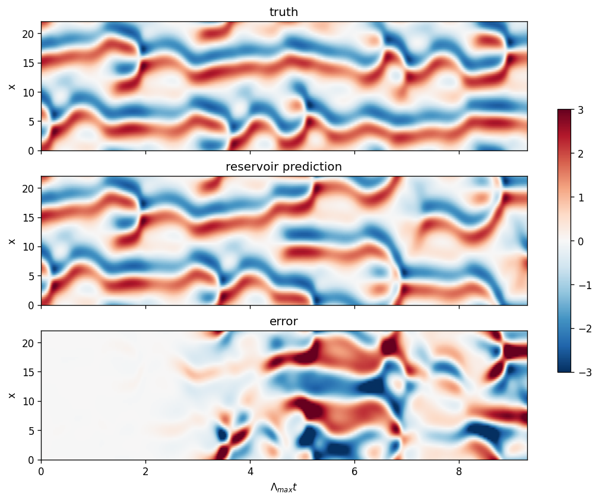

# Pathak et al. (2018) — Reservoir computing on Kuramoto–Sivashinsky

> J. Pathak, B. Hunt, M. Girvan, Z. Lu, E. Ott,
> *Model-Free Prediction of Large Spatiotemporally Chaotic Systems from Data:
> A Reservoir Computing Approach*,
> Phys. Rev. Lett. **120**, 024102 (2018).
> [DOI](https://doi.org/10.1103/PhysRevLett.120.024102)

**Claim being tested:** a reservoir computer trained only on observed data
predicts the Kuramoto–Sivashinsky system for roughly 8 Lyapunov times, with no
knowledge of the governing equation.

---

## Status

| Target | Published | Reproduced | Notes |
|--------|-----------|------------|-------|
| Fig. 2 — qualitative rollout, L=22, single reservoir | spacetime plot, no number | **VPT = 2.6 ± 0.4** Lyapunov times | figure reproduces; see below |
| Fig. 4 — valid prediction time, L=200, g=64 parallel | ~8 Lyapunov times | not attempted | the headline result lives here, not in Fig. 2 |
| λ₁ at L=22 | ~0.043 (literature) | 0.0466 | ETDRK4 solver, see `notes/ks_solver.md` |
| λ₁ at L=100–400 | 0.09 (Table I) | — | different domain regime; do not mix with the L=22 value |

**The published "8 Lyapunov times" belongs to Fig. 4**, the L=200 parallel-reservoir
configuration — not to the single-reservoir L=22 case reproduced here. Fig. 2 is a
qualitative spacetime plot with no stated number, so the 2.6 measured here has
nothing published to be scored against. This is a reproduction of the *method* at
the Fig. 2 configuration, not of the headline claim.

Run at the paper's parameters (`D_r=5000`, `T=70,000`, `ρ=0.6`, `σ=1.0`, `κ=3`),
K=10 intervals, NRMSE threshold 0.5:

- machine A: VPT = 2.66 ± 0.84
- machine B: VPT = 2.59 ± 1.31

independently generated trajectories, agreeing within sampling error.



Error is flat to Λ·t ≈ 2, structured by 3, saturated by 5 — consistent with the
measured VPT. After decorrelation the prediction remains recognisably
Kuramoto–Sivashinsky: correct cell width, correct amplitude range, correct
merging-and-splitting texture. The reservoir retains the attractor statistics
while losing the specific trajectory.

## Variance: why a single number is not a result

VPT on a chaotic attractor is noisy. Decomposed at `D_r=1000`, K=6:

| Source | Spread in VPT |
|--------|---------------|
| reservoir realisation (5 seeds, fixed trajectory) | 1.18–1.51, σ = 0.11 |
| KS trajectory (5 seeds, fixed reservoir) | 1.00–1.45, σ = 0.15 |
| sampling, K=6 | standard error 0.21 |
| sampling, K=30 | standard error 0.09 |

Trajectory variance exceeds reservoir variance. This is why the paper specifies
K=30 intervals *and* 10 reservoir realisations — at K=6 the sampling error alone
is comparable to the effect sizes being compared. Any VPT quoted without an
error bar from this system should be treated as uninformative.

---

## The system

The paper uses KS with an added spatial inhomogeneity:

```
y_t = -y·y_x - y_xx - y_xxxx + μ·cos(2πx/λ)
```

periodic on `[0, L)`, with `L` an integer multiple of `λ`. Setting `μ = 0`
recovers standard KS. The cosine term breaks translation symmetry, which
matters for the parallel scheme: with `μ = 0` a single trained reservoir can be
replicated across all `g` groups; with `μ = 0.01` it cannot.

Integrated on `Q` equally spaced points with `Δt = 0.25`, ETDRK4
(Kassam & Trefethen 2005).

## Parameters as published

| Symbol | Value | Meaning |
|--------|-------|---------|
| `D_r` | 5000 | reservoir nodes |
| `ρ` | 0.6 | spectral radius of adjacency matrix `A` |
| `σ` | 1.0 | `W_in` entries drawn uniform on `[-σ, σ]` |
| `κ` | 3 | average degree, directed Erdős–Rényi |
| `T` | 70,000 steps | training length (= 17,500 time units at Δt=0.25) |
| `l` | 6 | buffer overlap, parallel scheme only |
| `Δt` | 0.25 | timestep |

**Fig. 2 configuration:** `L=22`, `Q=64`, `μ=0`, single reservoir.
**Fig. 4 configuration:** `L=200`, `Q=512`, `μ=0.01`, `λ=100`, `g=64`.

### Reservoir update

```
r(t+Δt) = tanh( A·r(t) + W_in·u(t) )
```

No leak rate. No bias term.

### Output layer — the detail that breaks reproductions

```
W_out(r) = P₁·r + P₂·r²
```

The paper states the linear-only choice (`P₂ = 0`) typically did not work.
Their reasoning (ref. [16]): `tanh` is odd, so with `P₂ = 0`, if `r(t)` is an
attracting reservoir orbit producing output `v(t)`, then `-r(t)` is also
attracting and produces `-v(t)`. That symmetry conflicts with KS, which is not
invariant under `y → -y`. The quadratic term breaks it.

**If the rollout produces plausible-looking garbage, check this first.**

### Evaluation protocol

- `K = 30` non-overlapping prediction intervals, each of length `τ = 1000`
- before each interval: reset all reservoir states to `r = 0`, then drive with
  true data for `ε = 10` steps to set the initial condition
- RMSE averaged over the `K` intervals
- entire procedure repeated for 10 random reservoir realisations

### Lyapunov normalisation (Table I, λ=100, μ=0.01)

| L | Λ_max | D_KY |
|---|-------|------|
| 100 | 0.09 | 23 |
| 200 | 0.09 | 43 |
| 400 | 0.09 | 85 |
| 800 | 0.10 | 167 |
| 1600 | 0.10 | 338 |

Time axes are reported in Lyapunov times, `t · Λ_max`. Using the L=22 value
(≈0.043–0.047) for the L=200 case would misscale the axis by roughly 2×.

---

## What the paper does not specify

| Missing | Where it should be | Value used | Status |
|---------|--------------------|-----------|--------|
| ridge parameter `β` | Supplemental Material | `1e-4` | **resolved** — swept 1e-2…1e-10 at D_r=2000. β=1e-2 degrades (VPT 1.50); everything ≤1e-4 is flat at ≈1.85. Not a sensitive parameter. |
| RMSE threshold for "valid prediction" | — | NRMSE 0.5 | convention from the follow-on literature (Vlachas et al. 2020). Arbitrary but must be stated with any VPT. |
| reservoir washout before training | — | 1000 steps | not swept |
| transient discarded from KS data | — | 1000 time units | not swept |
| — | — | — | **trajectory dependence**: the result varies by ±0.15 across KS realisations, so the paper's number is only reproducible to about that precision even with everything else matched. |

---

## Layout

```
src/
  ks_solver.py        ETDRK4 integrator, validated (see notes/)
  lyapunov.py         leading Lyapunov exponent by trajectory separation
  reservoir.py        echo-state network, ridge training, autoregressive rollout
  evaluate.py         valid prediction time in Lyapunov units
  run_fig2.py         L=22, single reservoir
  run_fig4.py         L=200, g=64 parallel
notes/
  ks_solver.md        solver validation and the Hermitian-symmetry failure
  reservoir_theory.md why an untrained random network works
figures/
```

## Reproducing

```bash
python src/run_fig2.py      # correctness check, ~minutes
python src/run_fig4.py      # headline number, heavier
```

Generated data is not committed. Every result regenerates from a fixed seed.
